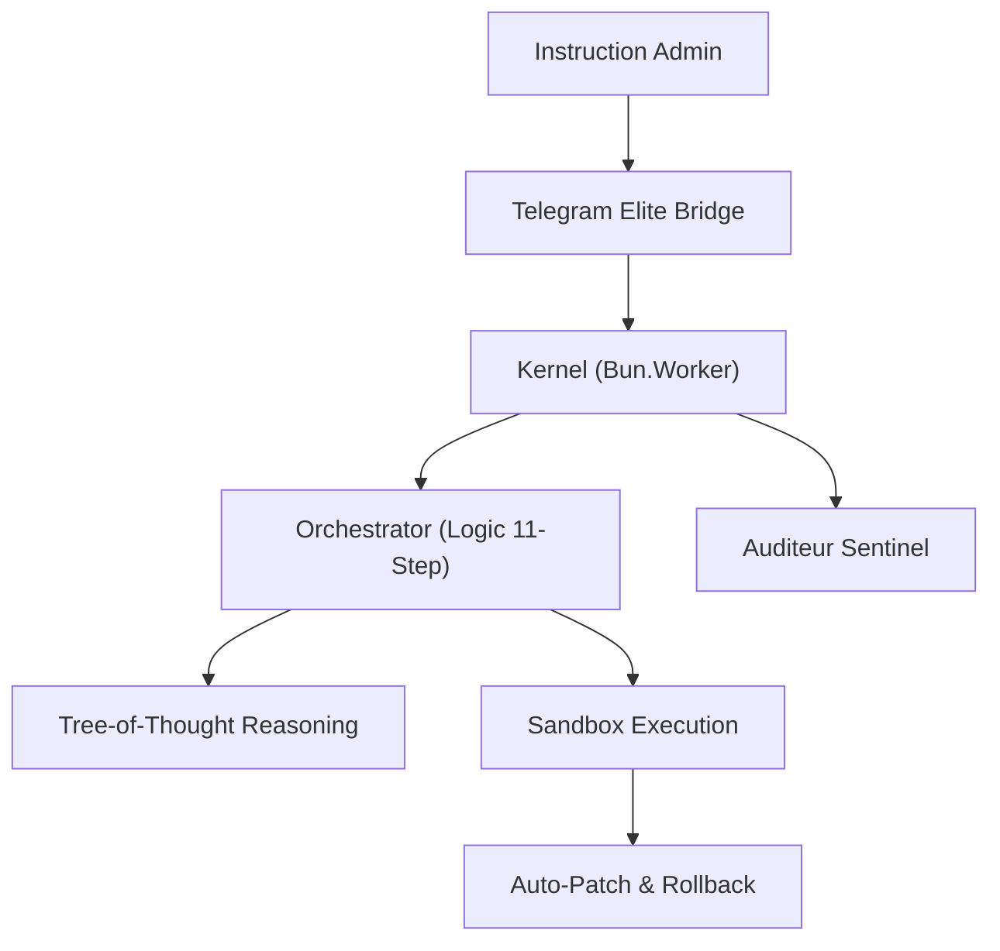

<div align="center">

# 🤖 AMFbot Suite

### The Ultimate Open Source AI That Owns the Keys to Your Computer

[](LICENSE)
[](https://nodejs.org/)
[](https://python.org/)
[](https://docker.com/)

**AMFbot is a sovereign AI assistant that runs entirely on your machine, with full system control, multimedia generation, and infinite extensibility via MCP.**

      
# 🛸 AMF-OS SOVEREIGN ELITE
### Blueprint 2026.1 - The Event-Driven Micro-Kernel for Modern Sovereignty

[](LICENSE)
[](https://bun.sh/)
[](#-security)
[](#-architecture)

**AMF-OS is a hyper-fast, self-healing AI Workstation. It doesn't just chat; it controls, fixes, and evolves entirely offline.**

[Démarrage Rapide](#-quick-start) • [Guide d'Installation (FR)](INSTALL_FR.md) • [Architecture](#-architecture) • [Sovereign Features](#-features)

</div>

---

## 🚀 Quick Start (Fast-Track)

```bash
# Clone & Enter the Matrix
git clone https://github.com/AMFbot-Gz/AMFbot-Suite.git && cd AMFbot-Suite

# Elite Bootstrap (Hardware-Aware)
bash setup/install.sh

# Ignite the Kernel
bun start
```

---

## ✨ features / capacités élites

### 🌀 Le Micro-Kernel Événementiel
- **Latence Zéro** : <150ms TTFT grâce au bus de données SSE natif de Bun.
- **Speculative Decoding** : Une pré-génératon ultra-rapide (qwen3:0.5b) validée en temps réel par le modèle maître (llama4:8b).
- **Swarm Intelligence** : Utilisation de workers parallèles pour la surveillance et l'exécution.

### 🩹 Auto-Réparation (Self-Healing)
- **Boucle ReAct** : Diagnostique automatiquement les erreurs shell, génère un patch via `qwen3:coder` et ré-exécute.
- **Rollback Atomique** : Utilise Git pour revenir instantanément à un état stable en cas de "Kernel Panic" logique.

### 🧠 Mémoire Souveraine (Local RAG)
- **LanceDB Enterprise** : Stockage vectoriel local haute performance pour apprendre de vos sessions.
- **Knowledge Base Tactique** : Mémorise les séquences de commandes réussies pour optimiser les futures interventions.

### 🛡️ Sécurité de Niveau Militaire
- **Air-Gapped Ready** : Conçu pour fonctionner sans aucune connexion Internet.
- **Sentinel Audit** : Surveillance proactive des accès et journalisation JSON structurée.

---

## 🏗️ Architecture Blueprint 2026.1



---

## 📦 Stack Technique "Elite-Only"

| Couche | Technologie | Rôle |
|-----------|------------|------|
| **Runtime** | Bun | Latence zéro, Workers natifs |
| **Logic** | llama4:8b | Raisonnement complexe |
| **Coding** | qwen3:coder | Génération & Patching |
| **Cache** | KeyDB | Hot-cache d'état ultra-rapide |
| **Memory** | LanceDB | Base de données vectorielle locale |

---

## 🤝 Contribution
Rejoignez l'élite. AMF-OS est une plateforme souveraine. Voir [CONTRIBUTING.md](CONTRIBUTING.md).

---

<div align="center">

**Dominons la machine. Soyons souverains.**
[⭐ Star us on GitHub](https://github.com/amfbot/amfbot-suite)

</div>
