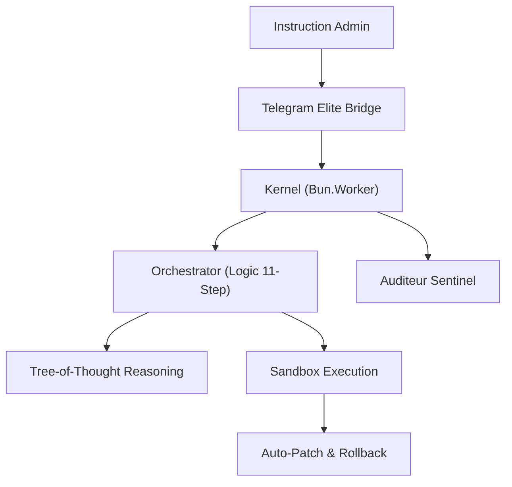

<div align="center">


# 🛸 AMF-OS SOVEREIGN ELITE
### Blueprint 2026.1 - The Event-Driven Micro-Kernel for Modern Sovereignty

[](LICENSE)
[](https://bun.sh/)
[](#-security)
[](https://github.com/AMFbot-Gz/AMFbot-Suite/actions)
[](#-versions--compatibilité)

**AMF-OS est une station de travail IA ultra-rapide, autonome et souveraine.**
*Elle ne se contente pas de discuter : elle agit, s'auto-répare et évolue entièrement sur votre matériel.*

[Démarrage Rapide](#-démarrage-rapide) • [Guide d'Installation (FR)](INSTALL_FR.md) • [Architecture](#-architecture-blueprint-20261) • [Pour les Développeurs](#-pour-les-développeurs)

</div>

---

## 🎯 Pour qui ?
*   **🧑‍💻 Devs Solo** : Automatisez votre workflow local sans quitter votre terminal.
*   **🛡️ Ops/SysAdmin** : Gérez vos serveurs via une interface souveraine sécurisée.
*   **🧪 Labs IA On-Prem** : Déployez une pile IA complète et privée en quelques secondes.

---

## 📋 Prérequis Minimaux
| Composant | Recommandé (Performance Elite) | Minimum (Mode Efficacité) |
|-----------|-------------------------------|---------------------------|
| **OS**    | macOS 14+ / Ubuntu 22.04      | macOS 13+ / Debian 11     |
| **RAM**   | 32 Go (Unified/DDR5)          | 16 Go                     |
| **GPU**   | NVIDIA 12Go VRAM / Apple M2+  | CPU-Only compatible       |
| **Espace**| 100 Go SSD (Modèles LLM)      | 40 Go                     |

---

## ⚡ Démarrage Rapide

### Option A : Installation Directe (Recommandé)
L'installateur intelligent détecte votre GPU et optimise les modèles automatiquement.

```bash
# Clonez et entrez dans la matrice
git clone https://github.com/AMFbot-Gz/AMFbot-Suite.git && cd AMFbot-Suite

# Lancez l'installation automatique
bash setup/install.sh

# Démarrez le Kernel
bun start
```

## Option B : 100% Docker (Isolation Totale)
Pour ceux qui préfèrent ne rien installer sur l'hôte, utilisez le mode conteneurisé.

```bash
docker-compose up -d --build
```
*Note : Assurez-vous d'avoir configuré votre `.env` au préalable.*

---

## ✨ Capacités d'Élite (v2.4)

### 🌀 Moteur de Skills Modulaire
AMF-OS utilise désormais un standard de **Skills dynamiques** (format `.md` + YAML) inspiré des meilleurs frameworks agentiques.
- **Départements** : Ops & Sécurité, Ingénierie Senior, Studio Créatif, Autonomie Loki.
- **Chargement Dynamique** : Le Kernel charge uniquement les compétences nécessaires à la tâche.

### 🧠 Raisonnement Agentique (ReAct + Reflection)
L'IA ne se contente plus de répondre ; elle réfléchit et apprend de ses actions :
- **Boucle ReAct** : Cycle `Thought > Action > Observation` pour une précision chirurgicale.
- **Hook Reflection** : Après chaque tâche, l'agent produit une auto-critique enregistrée dans la mémoire tactique (LanceDB), simulant une amélioration continue.

### 🛡️ Tool Registry & Sécurité
- **Permissions granulaires** : Chaque outil (shell, fs, network) possède un niveau d'accréditation (User, Admin, Root).
- **Hardening natif** : Documentation technique de la sandbox (VM/Firecracker) et guide de durcissement.

---

## 🎬 Scénarios d'Usage

### 📁 RAG Local Instantané
> "Analyse mon dossier `/src/kernel` et explique-moi comment la gestion de la mémoire est isolée."

### 🔧 Contrôle Système Autonome
> "Vérifie les logs nginx, identifie les IPs agressives et bloque-les via iptables après confirmation."

### 🎨 Génération Multimédia
> "Crée une image de couverture pour ma doc au format 16:9 style cyber-minimalist noir et magenta."

---

## 🏗️ Architecture Blueprint 2026.1



---

## �️ Pour les Développeurs

### Arborescence
*   `src/kernel/` : Le cœur réactif. Gère l'événementiel et les workers parallèles.
*   `src/core/` : L'orchestrateur logique, le routage des modèles et la spéculation.
*   `src/autonomy/` : Moteurs de self-healing, sandbox (Firecracker) et régénération.
*   `src/memory/` : Gestion LanceDB et stockage des patterns de succès.
*   `src/adapters/` : Connecteurs externes (Telegram, Ollama, Media-Gen).

### Mode Contribution
Consultez le guide [CONTRIBUTING.md](CONTRIBUTING.md) pour configurer votre environnement de test.

---

## 📈 Versions & Compatibilité

| Tag | Date | Évolutions Clés | CPU/GPU Focus |
|-----|------|-----------------|---------------|
| **v2026.1.1** | Fév 2026 | Refonte UX + Installateur Robuste | Hybrid (Metal/NVIDIA) |
| **v2026.1.0** | Jan 2026 | Initial Sovereign Blueprint | Multi-Node focus |

---

<div align="center">

**Maîtrisez votre machine. Soyons souverains.**
[⭐ Star us on GitHub](https://github.com/AMFbot-Gz/AMFbot-Suite)

</div>
