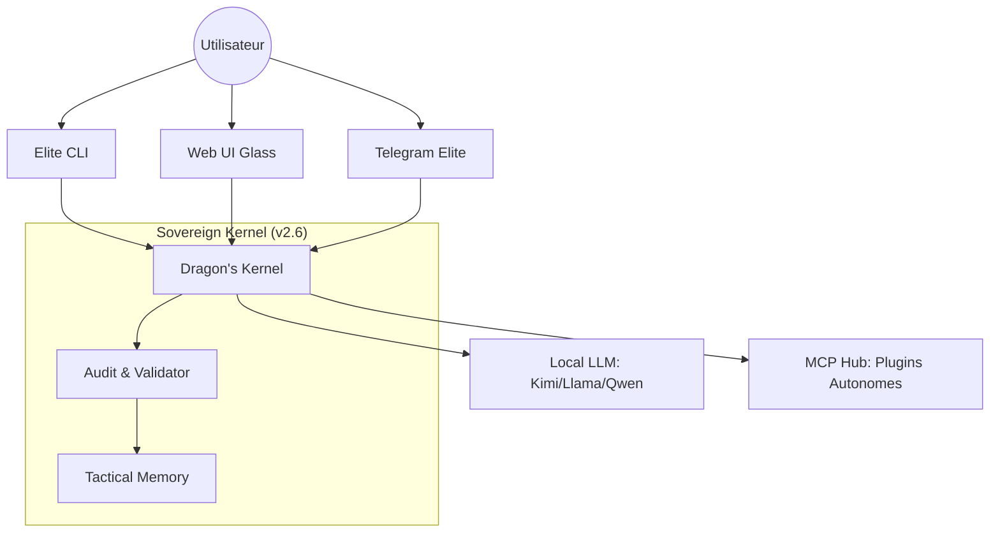

<div align="center">


# 🛸 AMFbot SOVEREIGN ELITE
### Blueprint 2026.1 - "The Elite Era" (v2.6.0)
**Infrastructure d'IA Souveraine, Multi-Plateforme & Ultra-Accessible**

[](#-sécurité-élite)
[](#-compatibilité-windows-native)
[](#-notre-manifeste)

**AMFbot v2.6 marque le passage du projet GitHub à une infrastructure de calibre industriel.**
*Libérez-vous du cloud. Prenez le contrôle total avec le Dragon's Kernel.*

[Démarrage Elite](#-le-setup-elite-en-un-clic) • [Guide Connecteurs](docs/connectors.md) • [Architecture Elite](docs/ARCHITECTURE.md) • [Sécurité](docs/security-deep-dive.md)

</div>

---

## 🐲 L'Identité Elite
AMFbot n'est plus seulement un bot, c'est une **marque de confiance**. Unifiée à travers toutes ses interfaces (CLI, Web, Telegram), elle repose sur trois piliers indéboulonnables :
1.  **Souveraineté Totale** : Vos clés, vos données, votre matériel.
2.  **Accessibilité Industrielle** : Prêt pour Windows, Linux et macOS dès la sortie de boîte.
3.  **Puissance Agentique** : Une boucle ReAct optimisée avec le support de modèles de pointe comme **Kimi k2.5**.

---

## 🚀 Le Setup Elite en Un Clic
L'installateur intelligent s'occupe de tout : hardening de sécurité, détection GPU et configuration MCP.

```bash
# Invoquez le Dragon instantanément
curl -fsSL https://amf-elite.sh/install.sh | bash
```

---

## 🛡️ Sécurité Élite : Zero Data Leakage
La version 2.6 introduit des mesures de sécurité de grade militaire :
*   **Protection LFI Native** : Un validateur de chemin surveille chaque accès fichier pour prévenir les fuites de données locales.
*   **Audit Logger Normalisé** : Chaque action agentique est tracée dans un log JSON exploitable par des outils tiers (SIEM).
*   **Privilèges Restreints** : Le mode Superuser est désormais encadré par des frontières de sécurité strictes.

---

## 🪟 Compatibilité Windows Native
AMFbot Elite supporte désormais officiellement Windows.
*   **Chemins Normalisés** : Gestion transparente des séparateurs de dossiers et des profils utilisateurs.
*   **CLI Autopick** : Détection automatique de PowerShell ou Bash pour une expérience sans friction.

---

## 🔌 Ubiquité & Connectivité Elite
Ne soyez plus jamais déconnecté de votre intelligence souveraine.
*   **Telegram Sync** : Synchronisation en temps réel de vos sessions entre votre machine et votre mobile.
*   **MCP Auto-Discovery** : AMFbot scanne et connecte automatiquement vos serveurs Model Context Protocol locaux.
*   **Modèles Synthétiques** : Routage intelligent vers Kimi k2.5 pour les tâches d'architecture complexes.

---

## 🏗️ Architecture Blueprint 2026.1



---

## 🎬 Scénarios d'Usage Elite
> **Ops** : "Vérifie la santé de mon cluster et bloque les IPs suspectes via la passerelle Telegram."
> **Dev** : "Génère un boilerplate NestJS avec auth JWT et valide-le dans une sandbox isolée."
> **Data** : "Scrape les actus sur l'IA souveraine et stocke une synthèse vectorielle dans ma Tactical Memory."

---

<footer>
<div align="center">
Built for the event-driven future. AMFbot-Suite is an open infrastructure for sovereign intelligence.
</div>
</footer>
