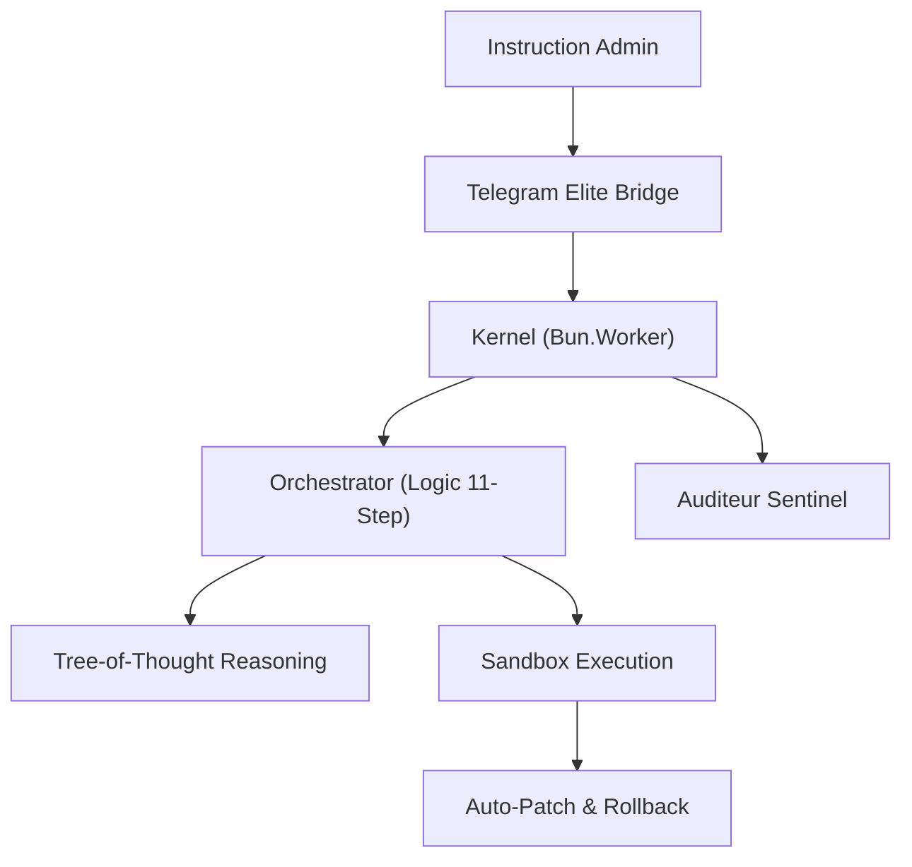

<div align="center">


# 🛸 AMF-OS SOVEREIGN ELITE
### Blueprint 2026.1 - The Event-Driven Micro-Kernel for Modern Sovereignty

[](LICENSE)
[](https://bun.sh/)
[](#-security)
[](#-architecture)

**AMF-OS est une station de travail IA ultra-rapide, autonome et souveraine.**
*Elle ne se contente pas de discuter : elle agit, s'auto-répare et évolue entièrement sur votre matériel.*

[Démarrage Rapide](#-démarrage-rapide) • [Guide d'Installation (FR)](INSTALL_FR.md) • [Architecture](#-architecture-blueprint-20261) • [Fonctionnalités](#-capacités-élites)

</div>

---

## ⚡ Démarrage Rapide (One-Click)

Destiné au "commun des mortels", cet installateur s'occupe de tout : détection de votre matériel (GPU NVIDIA/Mac M1-M3), installation de Bun, Docker et synchronisation des modèles.

```bash
# Clonez et entrez dans la matrice
git clone https://github.com/AMFbot-Gz/AMFbot-Suite.git && cd AMFbot-Suite

# Lancez l'installation automatique (Hardware-Aware)
bash setup/install.sh

# Démarrez le Kernel
bun start
```

---

## ✨ Capacités Élites

### 🌀 Micro-Kernel Événementiel
- **Inférence Ultra-Rapide** : Latence <150ms via le bus SSE natif de Bun.
- **Speculative Decoding** : Pré-génération par `qwen3:0.5b` validée instantanément par `llama4:8b`.
- **Swarm Intelligence** : Utilisation de workers parallèles pour la surveillance et l'exécution synchrone.

### 🩹 Auto-Réparation (Self-Healing)
- **Boucle ReAct Autonome** : Analyse les erreurs système, génère un correctif et ré-exécute sans intervention humaine.
- **Rollback Atomique** : En cas de défaillance critique, le système revient instantanément à son dernier état stable via Git snapshots.

### 🧠 Mémoire Souveraine (Local RAG)
- **LanceDB Enterprise** : Stockage vectoriel local haute performance.
- **Apprentissage Adaptatif** : Mémorise vos workflows et préférences pour devenir plus efficace à chaque session.

---

## 🏗️ Architecture Blueprint 2026.1



---

## 📦 Stack Technique "Sovereign"

| Couche | Technologie | Rôle |
|-----------|------------|------|
| **Runtime** | Bun | Latence zéro, Workers natifs |
| **Logic** | llama4:8b | Raisonnement complexe & Consensus |
| **Coding** | qwen3:coder | Génération & Patching de code |
| **Cache** | KeyDB | Hot-cache d'état ultra-rapide |
| **Memory** | LanceDB | Base de données vectorielle locale |

---

## 🛡️ Sécurité & Confidentialité
- **100% Hors-ligne** : Vos données et vos modèles ne quittent jamais votre machine.
- **Sentinel Audit** : Surveillance proactive et logs d'audit JSON pour une transparence totale.
- **Sandbox Isolé** : Exécution sécurisée des commandes système via VM/Firecracker.

---

## 🤝 Contribuer
Rejoignez l'élite. AMF-OS est une plateforme communautaire ouverte. Consultez [CONTRIBUTING.md](CONTRIBUTING.md) pour nous aider à bâtir le futur de l'IA souveraine.

---

<div align="center">

**Maîtrisez votre machine. Soyez souverain.**
[⭐ Star us on GitHub](https://github.com/AMFbot-Gz/AMFbot-Suite)

</div>
