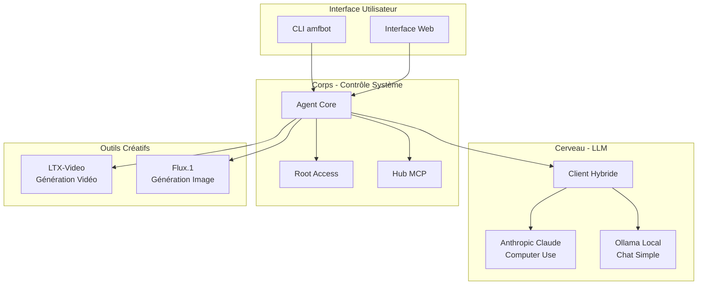

# AMFbot - Comment ça marche ?

## 🧠 Architecture Simplifiée



## 🔄 Flux de Décision Hybride

```
Requête Utilisateur
        ↓
  ┌─────────────────┐
  │ Analyse Tâche   │
  └────────┬────────┘
           ↓
    ┌──────┴──────┐
    │ Complexe ?  │
    └──────┬──────┘
           │
     ┌─────┴─────┐
     │           │
   Oui         Non
     │           │
     ↓           ↓
┌─────────┐  ┌─────────┐
│ Claude  │  │ Ollama  │
│ (API)   │  │ (Local) │
└─────────┘  └─────────┘
```

## 📂 Organisation des Fichiers

| Dossier | Contenu | Langage |
|---------|---------|---------|
| `src/core/` | Runtime Agent | TypeScript |
| `src/llm/` | Clients LLM | TypeScript |
| `src/cli/` | Interface CLI | TypeScript |
| `modules/media-gen/` | IA Image/Vidéo | Python |
| `mcp-hub/` | Serveurs MCP | TypeScript |
| `scripts/` | Installation | Bash |

## 🔐 Sécurité

1. **Isolation Docker** : Chaque module dans son conteneur
2. **Confirmation Sudo** : Toute commande privilégiée demande approbation
3. **Audit Log** : Historique de toutes les actions
4. **Local First** : Données sur votre machine, pas dans le cloud
